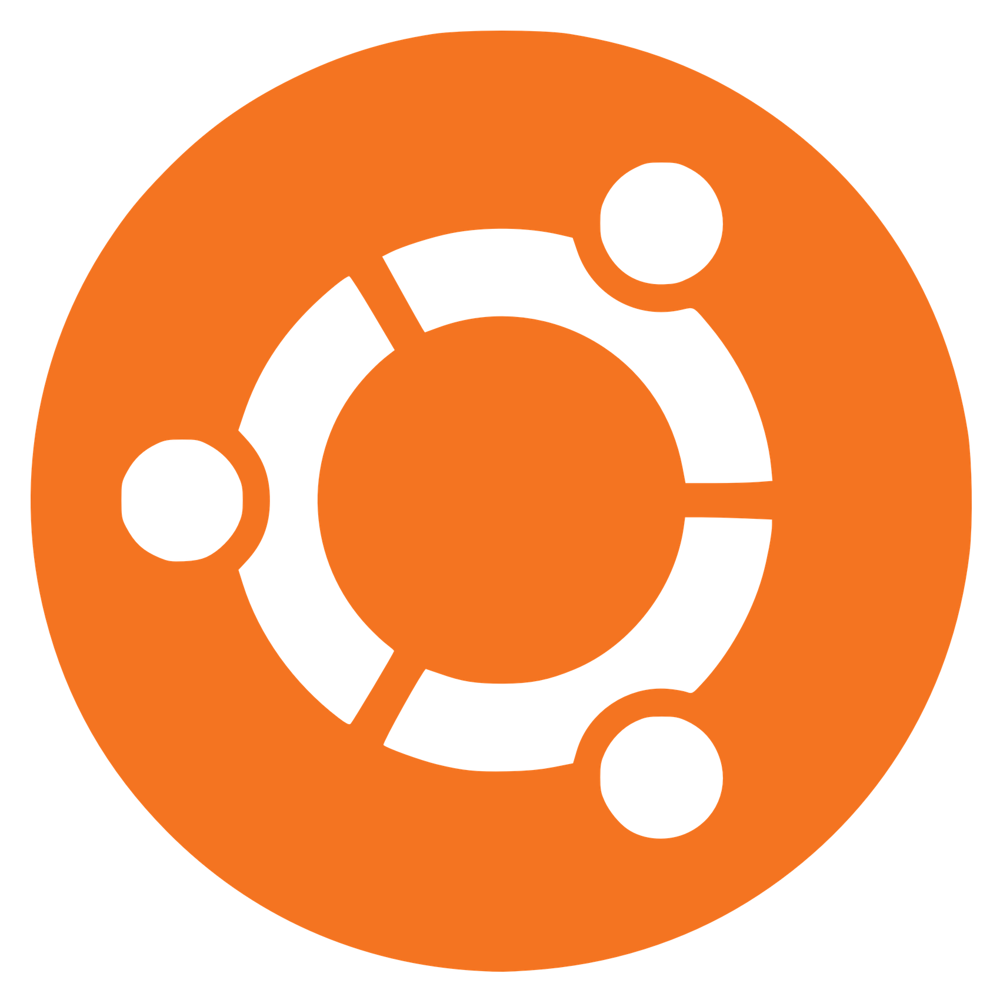
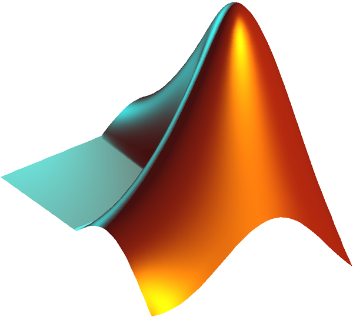
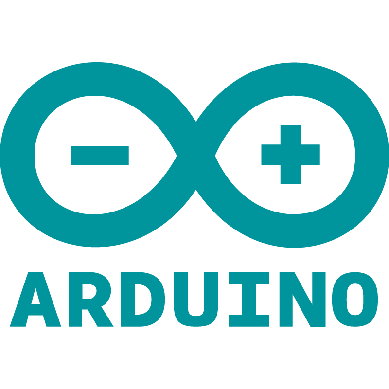

<!--
 * @Author: wenqing-2021 1140349586@qq.com
 * @Date: 2023-04-23 09:25:47
 * @LastEditors: wenqing-2021 1140349586@qq.com
 * @LastEditTime: 2023-04-23 09:54:55
 * @FilePath: /wenqing-2021/README.md
 * @Description: 这是默认设置,请设置`customMade`, 打开koroFileHeader查看配置 进行设置: https://github.com/OBKoro1/koro1FileHeader/wiki/%E9%85%8D%E7%BD%AE
-->
# Hi, Nice to meet you! 👋

## 😊 About me
My name is Shijie Yuan. I received the B.E. degree from the Faculty of Vehicle Engineering and Mechanics, Dalian University of Technology, in 2021. I am now a master student in the College of Mechanical and Vehicle Engineering, Hunan University, Changsha, China. My research interests include motion planning, safe reinforcement learning, decision-making  for autonomous vehicles 🚗.
- 📫 Email: yuansj@hnu.edu.cn
---
## ✨ Github Stats  

---
## 💻 Tools
 
 
 
 
 
 
 
 
 
 
 

---

<!--
**wenqing-2021/wenqing-2021** is a ✨ _special_ ✨ repository because its `README.md` (this file) appears on your GitHub profile.

Here are some ideas to get you started:

- 🔭 I’m currently working on ...
- 🌱 I’m currently learning ...
- 👯 I’m looking to collaborate on ...
- 🤔 I’m looking for help with ...
- 💬 Ask me about ...
- 📫 How to reach me: ...
- 😄 Pronouns: ...
- ⚡ Fun fact: ...
-->
